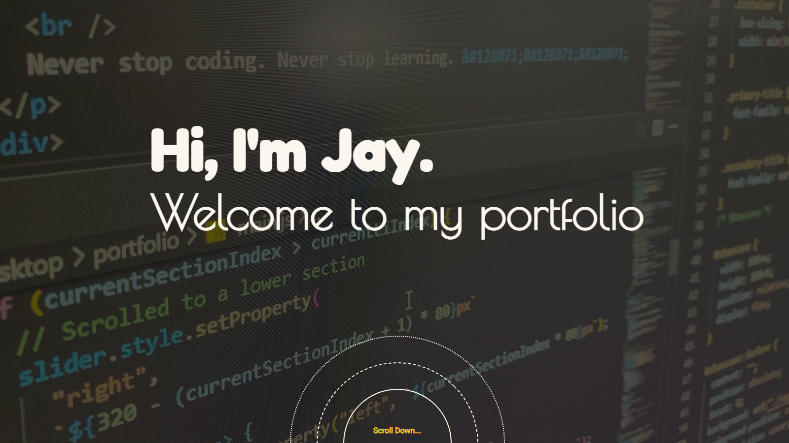

I'm a front-end (***full stack to be***) web developer. 

Check out the [Github Page](https://jay0223.github.io/).

Check out the [Repository](https://github.com/Jay0223/Jay0223.github.io) of my portfolio.

> Never stop coding. Never stop learning.

---

## What I've been up to

- ### Jan. 27 2022

1. Portfolio landing page launched.

2. Contact form needs to be functionalized.
3. Already have a lot of ideas for projects. Can't wait to build them!
